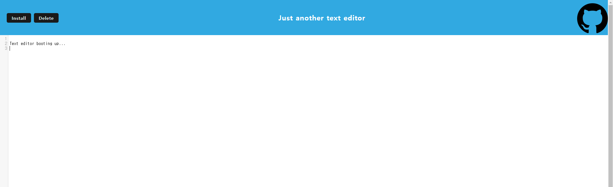

# text-editor

## Table of Contents

<ol>
<li>
<a href="#description"> Description </a>
</li>
<li><a href="#installation"> Installation </a>
</li>
<li>
<a href="#executing-program"> Executing program </a>
</li>
<li><a href="#usage"> Usage </a>
</li>
<li><a href="#contribution"> Contribution </a>
</li>
<li>
<a href="#tests"> Tests </a>
</li>
<li>
<a href="#screenshot"> Screenshot </a>
</li>
</ol>

## Description

A notes or code snippets with or without an internet connection.

## Installation

```
npm run install
```

Dependencies differ in main, client and server

## Executing program

After installation
<br>

```
npm run start
```

Run the local host: https://localhost:3000/

## Usage

Write anything on the post online or offline.

## Contribution

Git clone or fork the repository and create a feature for me ❤️

## Tests

Give it a shot!
<br>
Deployed on render:
<br>
https://text-editor-x2ih.onrender.com

## Screenshot
The following image shows the web application's appearance and functionality:
